<!-- Generated by GitHub Profile Agent Console. Edit profile.config.json, then run npm run generate. -->

  <picture>
    <source media="(max-width: 760px) and (prefers-color-scheme: dark)" srcset="./assets/hero/agent-console-40a4c878-mobile-dark.svg">
    <source media="(max-width: 760px)" srcset="./assets/hero/agent-console-40a4c878-mobile-light.svg">
    <source media="(prefers-color-scheme: dark)" srcset="./assets/hero/agent-console-40a4c878-dark.svg">
    <source media="(prefers-color-scheme: light)" srcset="./assets/hero/agent-console-40a4c878-light.svg">
    
  </picture>

  

## About Me

Data Analyst and Full-stack Developer with a strong passion for integrating information systems to optimize business operations.

Detail-oriented and highly adaptable, with a solid foundation in data analysis, system architecture, and building user-centric digital solutions.

## Current Focus

| Area | What I am exploring |
| --- | --- |
| **Software Development** | Building and integrating web and mobile applications to solve practical problems. |
| **Internet of Things (IoT)** | Implementing smart, connected solutions to bridge the gap between digital systems and the physical world. |
| **System Analysis** | Designing enterprise architectures and managing IT projects effectively. |

## Featured Work

| Project | Focus | Why it matters |
| --- | --- | --- |
| [**Gymate**](https://github.com/maritzaar/gymate) | Fitness Management App | A web application built with Laravel to help users efficiently track workout schedules and manage fitness data. |
| [**CarrierHub**](https://github.com/maritzaar/carrierhub) | Career Integration Platform | A career service platform developed using Java, JSP, and HTML/CSS to support students' professional needs. |
| [**Smart Tapping**](https://github.com/maritzaar/smart-tapping) | IoT Access Control | An automated attendance and access system leveraging RFID/NFC technology to improve process efficiency. |
| [**Parent Dashboard**](https://github.com/maritzaar) | User Interface Design | An intuitive digital dashboard designed to help parents digitally monitor their children's growth and daily activities. |

## Research Direction

I am driven by the potential of technology to streamline workflows and enhance operational efficiency through thoughtful system design and integration.

## Tech Stack

`Go` · `C++` · `Python` · `HTML` · `CSS` · `Linux`

## Recent Activity

<!-- AUTO:ACTIVITY:START -->
- Sep 3, 2026: pushed 1 commit to [maritzaar/dashboard_monitor](https://github.com/maritzaar/dashboard_monitor).
- Sep 2, 2026: pushed 1 commit to [maritzaar/dashboard_monitor](https://github.com/maritzaar/dashboard_monitor).
- Aug 21, 2026: pushed 1 commit to [maritzaar/dashboard_monitor](https://github.com/maritzaar/dashboard_monitor).
- Aug 20, 2026: created a branch in [maritzaar/dashboard_monitor](https://github.com/maritzaar/dashboard_monitor).
- Aug 19, 2026: pushed 1 commit to [maritzaar/dashboard_monitor](https://github.com/maritzaar/dashboard_monitor).
- Aug 18, 2026: pushed 1 commit to [maritzaar/dashboard_monitor](https://github.com/maritzaar/dashboard_monitor).
<!-- AUTO:ACTIVITY:END -->

---

  Driven by a commitment to continuous learning and technological innovation.

